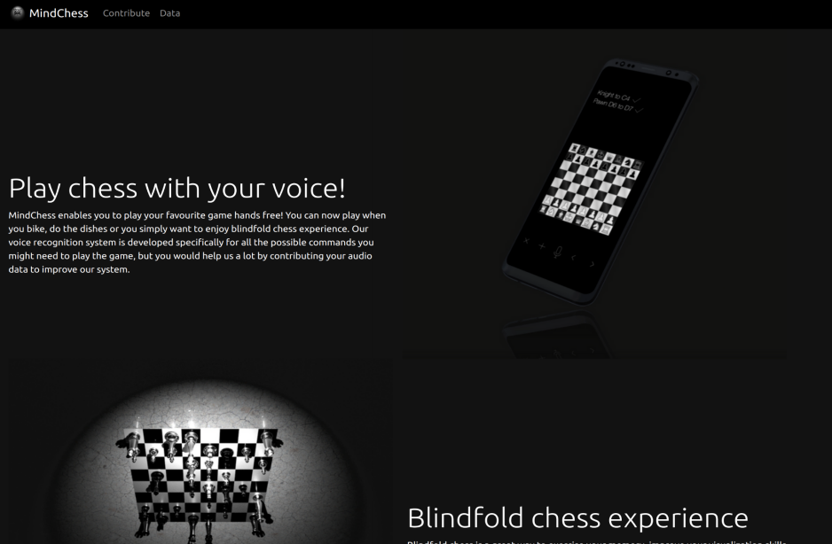
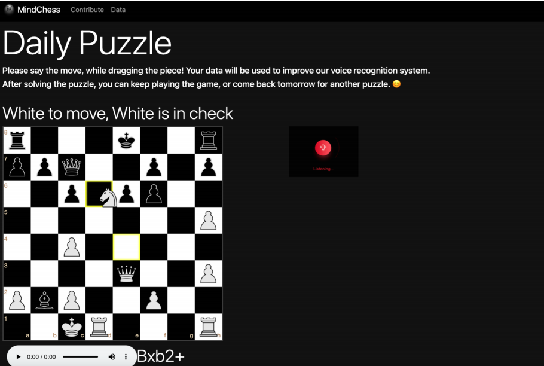
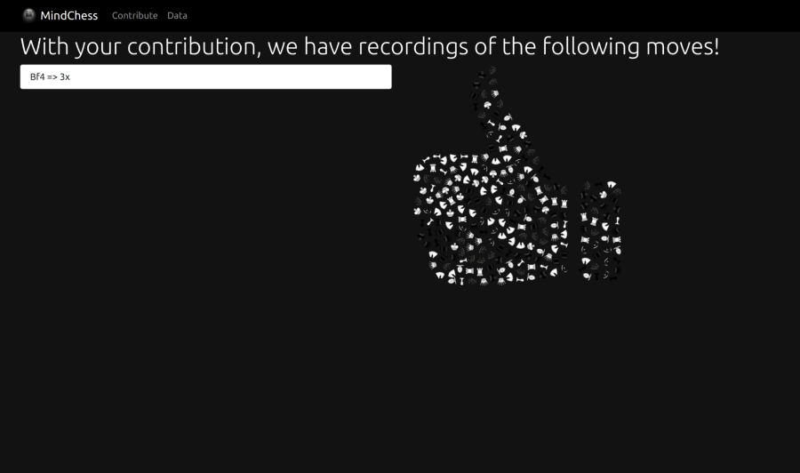

## Introduction
This is a website for collecting audio data to train a voice-controlled system for a chess application.

## Installation
To be able to use database for displaying collected data, [Mongo](https://www.mongodb.com) is required. However, the rest of the website can function properly without it.
  1. Download or clone the repository
  2. Navigate to website's folder
  3. Use npm install
  ```bash
  npm install
  ```
  4. Use npm start
  ```bash
  npm start
  ```
  5. The server should be running on the port 3000 in your local host. To open it, go to http://localhost:3000/
    
## Screenshots

'Home' destination <br>



'Collect data' destination <br>



'Show data' destination <br>

